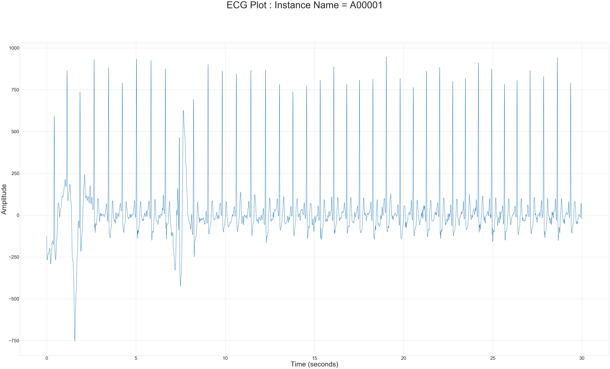
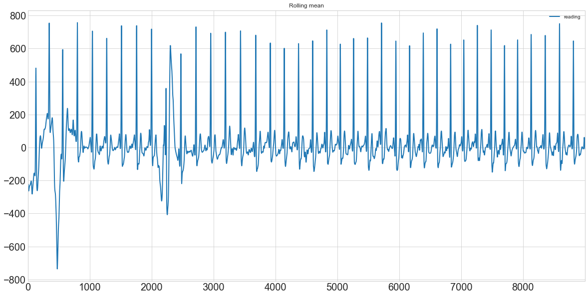
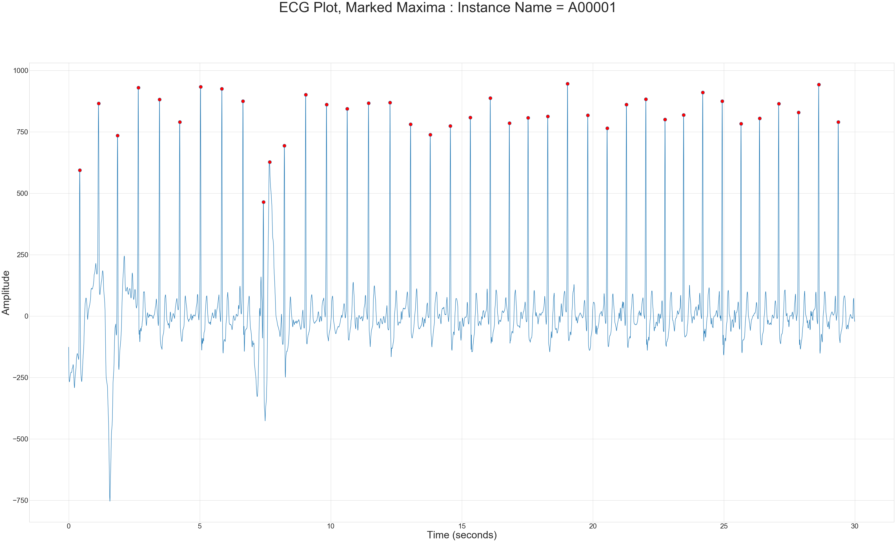
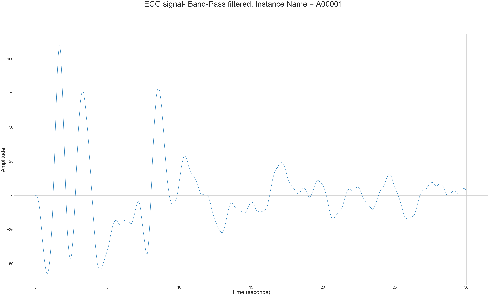
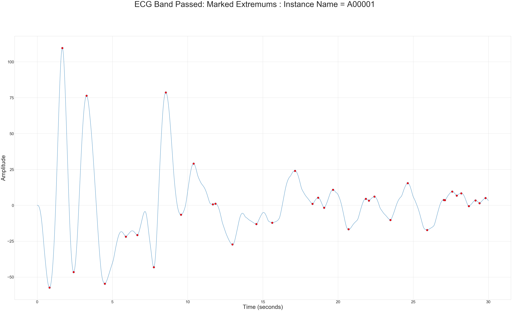
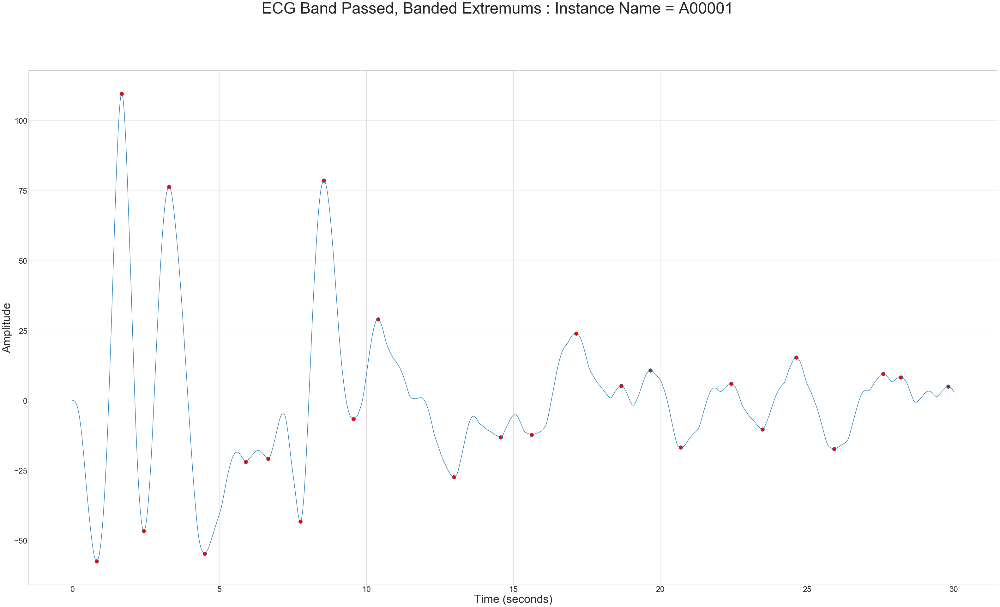
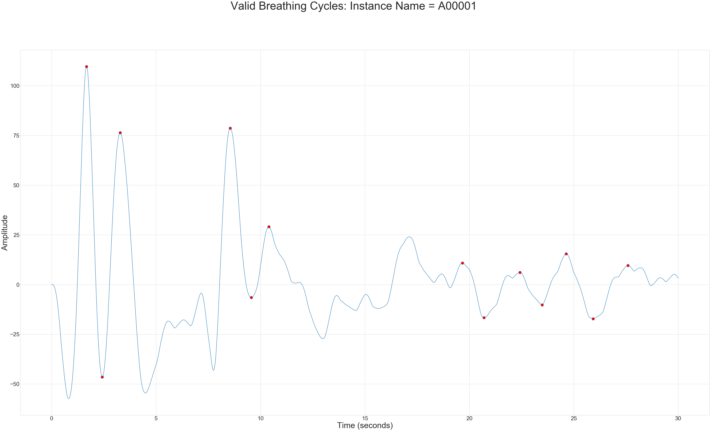
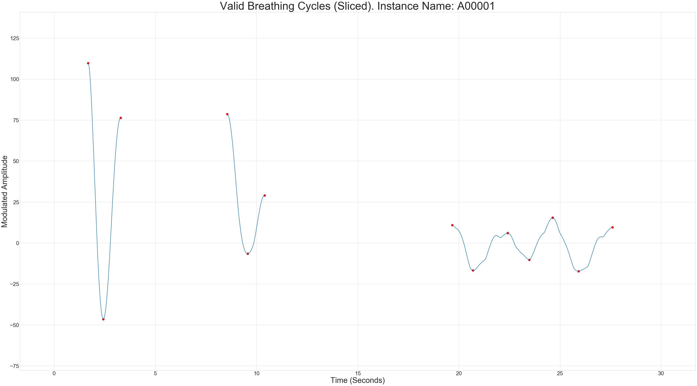
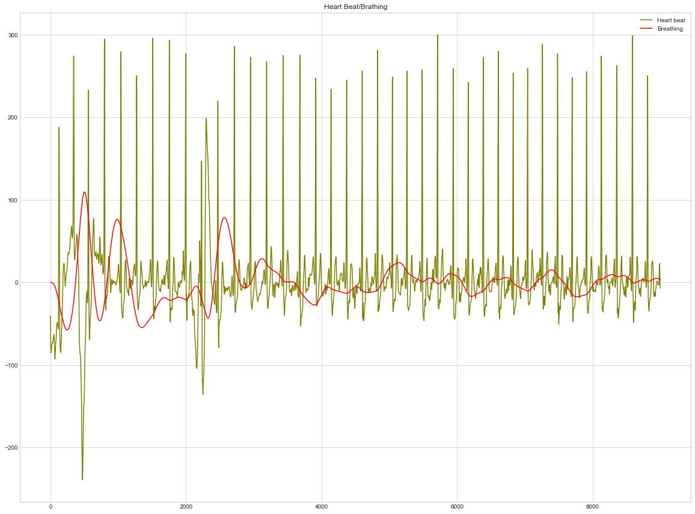

```python
""" HEADER: 
MindMics problem statement: Analysis of ECG data to find Heart rate and Breathing rate.
Data source: https://physionet.org/content/challenge-2017/1.0.0/training2017.zip
Data description: https://physionet.org/content/challenge-2017/1.0.0/

Author: Ashwin Padmanabhan
Date: 1/30/2020
"""

import scipy.io 
import os

download_path = "datasets/training2017/"
file_path = "A00001.mat"
instance_label = file_path[0:-4]

def getECGdata(download_path = download_path, file_path = file_path):  
    """
    Function to read *.mat from workspace (datasets/training2017) as Py list. 
    
    Parameters:
    ------------
    
    download_path = Path to dir. 
    file_path = (*.mat) Instance name. 
    
    Returns: 
    --------
    
    res = 1-D list of ECG readings. 
    """
    
    data_path = os.path.join(download_path, file_path)
    res = scipy.io.loadmat(download_path + file_path)
    return list(res["val"][0])
    
data = getECGdata()
```


```python
"""
Exploratory plot of ECG data. 

Questions asked: 
    1. Does this even look like ECG data? 
    2. Data quality: NaNs, Outliers, Scales. 
    3. Time axis: len(data)/300. ECG machine is 300Hz, frequency of readings per sec. 
    4. Look for general attributes: Range/Frequency/Auto-correlation/stationarity of ECG readings (time-series). 
"""

%matplotlib inline
import matplotlib.pyplot as plt

def lineplot(data, fig_size = (55,30), instance_name = "", fig_title = "ECG Plot ", 
            xax_label = "Index", yax_label = "Amplitude", 
            fontsize_title = 50, fontsize_ticks = 25, fontsize_xlabel = 36, fontsize_ylabel = 36
            ,plot_in_seconds = True, mark = []):
    """
    Generalized Plotting Function. 
    
    Parameters:
    ------------
    ------------
    
    Necessary: 
    ----------
    
    data = 1-D list/Dataframe/np array. 
    
    Optional:
    ----------
    fig_size = tuple(length, width), plot canvas size. 
    instance_name = str, show instance name in plot title. 
    fig_title = str, figure title. 
    xax_label = str, x-axis label. 
    yax_label = str, y-axis label. 
    fontsize_X => X: title/ticks,xlabel,ylabel = int, fontsize setting. 
    plot_in_second = boolean, plot with respect to time/index. 
    mark = list[int], list of marker indices to mark in the plot. 
    """
    
    plt.style.use('seaborn-whitegrid')
    
    #Set plot parameters: 
    fig = plt.figure(figsize = fig_size)
    ax = plt.axes()
    
    #Labels,axis,title paramaters: 
    if instance_name != "":
        fig_title = fig_title + ": Instance Name = "+ instance_name
         
    fig.suptitle(fig_title, fontsize=fontsize_title)
    ax.tick_params(labelsize=fontsize_ticks)      
    plt.ylabel(yax_label, fontsize=fontsize_ylabel)
        
    if not plot_in_seconds: 
        plt.xlabel(xax_label, fontsize=fontsize_xlabel)
        iterat = [i for i in range(len(data))]
    else:
        plt.xlabel("Time (seconds)", fontsize=fontsize_xlabel)
        #re-scaling units to seconds. 
        iterat = [i/300 for i in range(len(data))]
        
    #Plotting:
    if mark != []:
        ax.plot(iterat, data, markerfacecolor = "red", markersize = 12, marker = "o", markevery = mark)
    else: 
        ax.plot(iterat, data)

lineplot(data, instance_name = instance_label, plot_in_seconds = True)

"""
Inferences:

Seems like a ECG plot (haha), Good data quality (no NaNs, outliers), Amplitude range ~ (-750,1000)
"""
```


    '\nInferences:\n\nSeems like a ECG plot (haha), Good data quality (no NaNs, outliers), Amplitude range ~ (-750,1000)\n'





```python
"""
Exploratory analysis: Time-series, prudent to check for seasonality: 

Perhaps there is a error in the ECG machine as it is switched on or once it has been on for some time; unlikely, but no bias! 
Plotting the rolling mean and looking for clear increase/decrease. 
"""

"""
Inference: 

Rolling mean looks stationary. No clear increasing/decreasing trend. Good to go! 
"""

import pandas as pd

def plotRollingmean(data= data, column = "reading", meaninterval = 300):
    """
    Function to plot the rolling mean of ECG time series. Plotted against index number. 
    """
    
    df = pd.DataFrame(data, columns = [column])
    df2plot = df[[column]]
    
    #plot. 
    df2plot.rolling(int(len(df2plot)/meaninterval) ).mean().plot(figsize=(20,10), 
                                                        linewidth=2, fontsize=20, title = "Rolling mean")

plotRollingmean(meaninterval = 1000)


```





```python
"""
Determining the heart-rate from ECG data. 

Method used: 
            "The 300 method" (ref: https://rebelem.com/ecg-basics/)
            Count number of 0.2 second intervals between two "R" points in the ECG. Divide by this by 300. 

First need the R points. 
"""

import numpy as np

def findextremum(data = data, overmean_threshold=22, plot = True, find_minima = False, 
                 fig_title = "ECG Extremum", instance_name = instance_label):
    """
    Generalized Function to obtain extremum from ECG. Optional to plot. 
    
    Parameters:
    ----------
    
    data = 1-D list/Dataframe/np array. 
    overmean_threshold = int, Factor over mean to consider it a spike. 
    plot = bool, True to plot signal with marked extremum.
    find_minima = bool, True if minimas also need to be returned/plotted. 
    instance_name = str, show instance name in plot title. 
    fig_title = str, figure title.
    
    Returns: 
    --------
    
    res = list of list. res[0], indices of maximas. res[1], indices of minimas. 
    """
    
    """
    Inferences/Comments: 

    "overmean_threshold" needs to be carefully selected. 
        1. Some thought must go into selecting a values which workes for most instances. Or an algo. to auto-tune this paramter. 

    """
    
    releventindices, res, maximums, minimums = [], [], [], []
    meanreading = np.mean(data) 
    
    #Get rid of consecutively identical readings, temporarily, to check for extremums.
    releventindices = [i for i in range(len(data)-1) if data[i] != data[i-1]]
    
    #Find indices with local maximas with values > overmean_threshold*meanreading. 
    maximums = [releventindices[i] for i in range(1, len(releventindices)-1) if data[releventindices[i]] > data[releventindices[i-1] ] and data[releventindices[i+1] ] < data[releventindices[i] ] 
                                                                               and data[releventindices[i] ]/meanreading > overmean_threshold ]
    
    #Find indices with local minimas with abs(values) > overmean_threshold*meanreading. 
    if find_minima: 
        minimums = [releventindices[i] for i in range(1, len(releventindices)-1) if ( data[releventindices[i]] < data[releventindices[i-1]] and data[releventindices[i+1] ] > data[releventindices[i] ] )
                                                                               and (abs(data[releventindices[i] ])/meanreading > overmean_threshold) ]
    if plot:
        lineplot(data, mark = maximums + minimums, instance_name = instance_label, fig_title = fig_title)
    return [maximums, minimums]

Rpoints_ix = findextremum(plot = True, instance_name = instance_label, fig_title = "ECG Plot, Marked Maxima ")
Rpoints_ix = Rpoints_ix[0]


```





```python
"""
Calculating the heart-rate from found R points. 
"""
import statistics as stat

def CalcHeartrate(data = data, R_points_ix = Rpoints_ix):
    
    """
    Calculating heart rate from extremum points. 
    
    Parameters: 
    -----------
    
    data =  1-D list/Dataframe/np array. 
    R_points_ix =  1-D list/Dataframe/np array, indices of points of maxima. 
    
    Returns: 
    ---------
    
    res = list(list, float), res[0] - individual heart readings between each extremum. res[1] = mean heart reading.
    """
    
    #Only considering part of the timeseries starting/ending with a extremum.. 
    
    data_heartrate = data[min(Rpoints_ix):max(Rpoints_ix)]
    
    """
    300 divided by:((index1/300) - (index2/300))/0.2 
        Inner paranthesis converts index to second, 
        Outer paranthesis finds number of 0.2 second chunks. 
    """
    heart_rate = [(300/((Rpoints_ix[i + 1]/300 - Rpoints_ix[i]/300)/0.2)) for i in range(len(Rpoints_ix)-1)] 
    
    return [heart_rate, round(np.mean(heart_rate), 4)]

heartrate = CalcHeartrate()
print("Mean Heart Rate = ", heartrate[1])
print("Standard deviation of heart readings: ", round(stat.stdev(heartrate[0]),5) )

```

    Mean Heart Rate =  84.2004
    Standard deviation of heart readings:  28.3553


```python
"""
Brief insight into heart rates: 
"""

"""
Inferences/Comments: 
1. Min/Max could characterize periods of irrregular beating of the heart. 
2. Stdev could perhaps characterize similar things, but could comment of frequency of irregular beating. 
        Would perhaps need normal heart-beat labels (instances) to think of thresholds on stdev to characterize irregular beating. 
"""

df_heartrate = pd.DataFrame(heartrate[0],  columns = ["heartRate"])
df_heartrate.describe()
```


<div>
<style scoped>
    .dataframe tbody tr th:only-of-type {
        vertical-align: middle;
    }

    .dataframe tbody tr th {
        vertical-align: top;
    }

    .dataframe thead th {
        text-align: right;
    }
</style>
<table border="1" class="dataframe">
  <thead>
    <tr style="text-align: right;">
      <th></th>
      <th>heartRate</th>
    </tr>
  </thead>
  <tbody>
    <tr>
      <td>count</td>
      <td>39.000000</td>
    </tr>
    <tr>
      <td>mean</td>
      <td>84.200351</td>
    </tr>
    <tr>
      <td>std</td>
      <td>28.355303</td>
    </tr>
    <tr>
      <td>min</td>
      <td>73.170732</td>
    </tr>
    <tr>
      <td>25%</td>
      <td>76.272556</td>
    </tr>
    <tr>
      <td>50%</td>
      <td>79.295154</td>
    </tr>
    <tr>
      <td>75%</td>
      <td>82.191781</td>
    </tr>
    <tr>
      <td>max</td>
      <td>253.521127</td>
    </tr>
  </tbody>
</table>
</div>


```python
"""
Estimating breathing rate using Count-Orig method. 

Refer: 
    1. Charlton, et al. "Breathing rate estimation from the electrocardiogram and photoplethysmogram: A review." IEEE reviews in biomedical engineering 11 (2017)
    2. Schäfer, Axel, and Karl W. Kratky. "Estimation of breathing rate from respiratory sinus arrhythmia: comparison of various methods." Annals of Biomedical Engineering 36,(2008)
"""


import copy

data_br = copy.deepcopy(data)

def medianpassfilter(data_br = data_br, instance_label = instance_label, fig_title = "ECG Signal, Median Filtered", plot = False):
    """
    Function to perform median pass filtering to remove very low freq noise. 
    
    Parameters: 
    -----------
    
    data_br = 1-D list/Dataframe/np array, breading rate copy. 
    plot = bool, True to plot new filtered signal. 
    instance_label = str, show instance name in plot title. 
    fig_title = str, figure title.
    
    Returns: 
    ---------
    
    data_br = 1-D list/Dataframe/np array, median filtered signal. 
    """
    
    median_heartrate = np.median(data_br)
    data_br = [i - median_heartrate for i in data_br]

    if plot:
        lineplot(data_br, instance_name = instance_label, fig_title = fig_title )
    return data_br

data_br = medianpassfilter(plot = False)

```


```python
"""
Performing band-pass filtering and smoothing to meadian reduced signal. Refer [2] for low/high cut values. 

Refer: https://scipy-cookbook.readthedocs.io/items/ButterworthBandpass.html for function definition. 
"""

from scipy.signal import butter, lfilter

lowcut = 0.1
highcut = 0.5
fs = 300

def butter_bandpass(lowcut, highcut, fs, order=5):
    nyq = 0.5 * fs
    low = lowcut / nyq
    high = highcut / nyq
    b, a = butter(order, [low, high], btype='band')
    return b, a

def butter_bandpass_filter(data, lowcut, highcut, fs, order=5):
    b, a = butter_bandpass(lowcut, highcut, fs, order=order)
    y = lfilter(b, a, data)
    return y

data_br_bandpass = butter_bandpass_filter(data_br, lowcut, highcut, fs, order=3)

lineplot(data_br_bandpass, fig_title = "ECG signal- Band-Pass filtered", instance_name = instance_label )

```





```python
"""
Use findextremum(), with find_minima = True to get all extremum values.
"""

"""
Here "overmean_threshold" it is set at dummy value = -10 to include all minima and maxima with values > 0. Refer [2]. 
"""

extremums_bandpass = findextremum(data = data_br_bandpass, find_minima = True, overmean_threshold = -10, fig_title = "ECG Band Passed: Marked Extremums ")

```





```python
"""
Capping all maxima values to be greater than 0.2*(3rd quantile) and minima less than (1st quantile) as describes in [2]. 

Procedure describes in [2], "Estimation of breathing rate from respiratory sinus arrhythmia: comparison of various methods.", Schäfer et al.  
"""

#Getting max and min lists. 
maximum_values = [data_br_bandpass[i] for i in extremums_bandpass[0] ]
minimum_values = [data_br_bandpass[i] for i in extremums_bandpass[1] ]

#Find the respective quantiles. 
maximum_bandpass_thirdquantile = np.quantile(maximum_values, 0.75)
minimum_bandpass_thirdquantile = np.quantile(minimum_values, 0.25)

#Banding the maxima and minima within these quantiles. 
maximums_banded = [i for i in extremums_bandpass[0] if  data_br_bandpass[i] > 0.2*maximum_bandpass_thirdquantile]
minimum_banded = [i for i in extremums_bandpass[1] if data_br_bandpass[i] < 0.2*minimum_bandpass_thirdquantile ]

#Plotting banded extrememums 
lineplot(data = data_br_bandpass, mark = maximums_banded + minimum_banded, fig_title = "ECG Band Passed, Banded Extremums ", instance_name = instance_label)

```





```python
"""
Getting valid breathing cycles: 
    1. Between two maxima, one and only one minima must exist. 
    2. Minima must be less than 0. 
"""

valid_resp_cycle = []

extremum_banded_list = maximums_banded + minimum_banded
extremum_banded_list.sort()

for i in range(1,len(extremum_banded_list)-1):
    if (data_br_bandpass[ extremum_banded_list[i] ] < data_br_bandpass[extremum_banded_list[i-1] ] and data_br_bandpass[ extremum_banded_list[i] ] < data_br_bandpass[extremum_banded_list[i+1] ] 
        and data_br_bandpass[ extremum_banded_list[i] ] < 0 and data_br_bandpass[extremum_banded_list[i-1]] > 0
        and data_br_bandpass[extremum_banded_list[i+1]] >0):
        
        valid_resp_cycle += [extremum_banded_list[i-1], extremum_banded_list[i], extremum_banded_list[i+1]]

lineplot(data_br_bandpass, mark = list(set(valid_resp_cycle)), fig_title = "Valid Breathing Cycles", instance_name = instance_label )

```





```python
"""
Plotting valid breathing cycle signals, in sliced piecewise signals. 
"""

import pylab as pl
from matplotlib import collections as mc

templist, lines = [], []

#lines must be a list of list. [[[x1, y1]], [x2,y2], ... ], [similartly for 2nd piecewise line. ] 
#Require a double-for for generating lines... (revisit)

for x in range(0, len(valid_resp_cycle)-2, 3):
    templist = range(valid_resp_cycle[x],valid_resp_cycle[x+2],1)
    consolidatedlist = []
    for j in templist:
        consolidatedlist.append([j/300, data_br_bandpass[j]])
    lines.append(consolidatedlist)

#marking start-stop of each "lines". 
mark = [valid_resp_cycle[i] for i in  range(0, len(valid_resp_cycle)-2, 3)]

lc = mc.LineCollection(lines,  linewidths=2, )

#Plotting parameters: Figure, label, title, x, y, dot_color, dot_size, margins. 

fig, ax = pl.subplots(figsize = (55,30))
ax.set_xlim(-1.7, len(data_br_bandpass)/300 + 1.7)
ax.tick_params(labelsize=25) 
pl.xlabel("Time (Seconds)", fontsize = 35)
pl.ylabel("Modulated Amplitude", fontsize = 35)
pl.title("Valid Breathing Cycles (Sliced). " + "Instance Name: " + instance_label, fontsize = 50)
x = [i/300 for i in valid_resp_cycle]
y = [data_br_bandpass[j] for j in valid_resp_cycle]
ax.scatter(x, y, c = "red", s= 90)
ax.add_collection(lc)
ax.margins(0.2)
```





```python
"""
Function to calculate the breathing rate from filtered signal data. 
Each Piece-wise line is a valid breathing cycle. Characterizes seconds/breath. Reciprocal will give #breaths/time(units). 
"""

"""
Inferences/Comments: 

Standard Deviation not reliant since sample size < 30. Need largers number of valid breathing cycle to comment 
on validity of st. deviation measure. Sample size only = 5 for this case. 
"""

def CalcBR(data_br_bandpass= data_br_bandpass,valid_resp_cycle = valid_resp_cycle ):
    
    """
    Calculating breathing rate from extremum points. 
    
    Parameters: 
    -----------
    
    data_br_bandpass =  1-D list/Dataframe/np array. 
    valid_resp_cycle =  1-D list/Dataframe/np array, indices of points with valid breathing cycles. 
    
    Returns: 
    ---------
    
    res = list(list, float), res[0] - individual breathing readings between each triplet of readings. res[1] = mean breathing rate.
    """
    
    br = []
    for x in range(0, len(valid_resp_cycle)-2, 3):
        br.append(300 * 60/(valid_resp_cycle[x+2] - valid_resp_cycle[x]) ) #breaths per minute. 300 to rescale x-axis in seconds. 
    return([br, np.mean(br)])

br = CalcBR()
print("Average Breathing rate is: ", br[1])
print("Standard Deviation of breathing rate is:  ", stat.stdev(br[0]))


```

    Average Breathing rate is:  27.795609086169396
    Standard Deviation of breathing rate is:   7.1514846567431745


```python
"""
Function to juxtapose breathing and heart beat cycles. Both measures have been appropriately re-scales. Just to see what is looks like. 
"""

def juxtapose(data = data, data_br_bandpass = data_br_bandpass, fig_size = (20,15), fig_title = "Heart Beat/Brathing", fontsize = 40):
    """
    Calculating breathing rate from extremum points. 
    
    Parameters: 
    -----------
    
    data =  1-D list/Dataframe/np array, 1st set of data. 
    data_br_bandpass =  1-D list/Dataframe/np array, 2nd set of data. 
    fig_size = tuple, (length, width) of figure. 
    figtitle = str, Figure title. 
    
    Returns: 
    ---------
    
    NULL
    """
        
    plt.figure(figsize = fig_size)

    data_norm = [i*300/max(data) for i in data]

    plt.plot(data_norm, color = "olive", label = "Heart beat")
    plt.plot(data_br_bandpass, color = "red", label = "Breathing" )
    plt.legend(loc="upper right")
    plt.title(fig_title)
    
juxtapose()
```





```python

```
